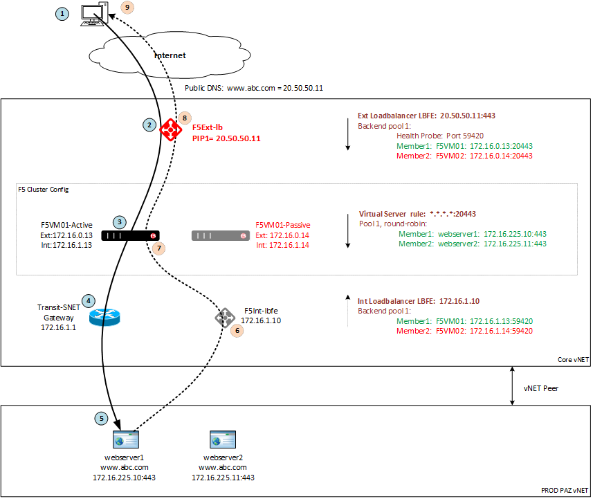
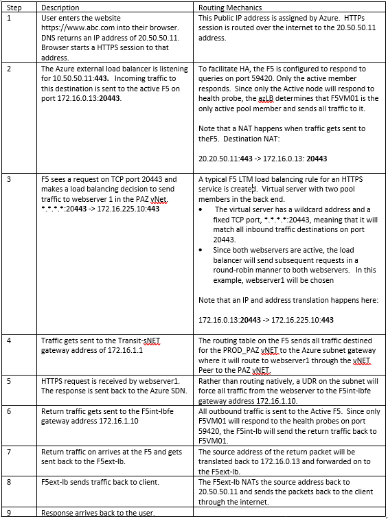
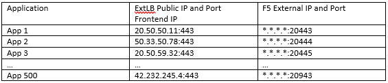

High Availability and Azure Load Balancers
==========================================

In order to achieve High Availability for the F5 and the Fortigate appliances, there are 3 Azure Load Balancers (AzLB) deployed to facilitate the High Availability mechanisms for both the F5 cluster and the FortiGate cluster. This follows vendor best practices. There are 2 types, internal and external. They both perform the following tasks:

1)  Health checking of each cluster member. Since only the active member will respond to the health check, the AzLB will only forward traffic to the active member. In this particular case, the AzLB must use the **HA Port** feature that is optimized for providing HA to Network Virtual Appliances (NVA).

2)  Provide a timely failure detection and failover time. Both F5 and FortiGate have SDN API integration that would not require the AzLB. There are some shortcomings which the AzLB will overcome including:

    a.  Azure has had some unpredictable API communications response times ranging from 30s to 20 minutes to detect failover and change routing tables to redirect traffic to the Backup node. The AzLB has a predictable failover time of around 10 secs.

    b.  The API cannot make routing table changes to routing tables in a different VNET, which is required to facilitate failover on VNETs peering to the core.

3)  Act as a next hop gateway for traffic bound for the F5 or the FG.

In addition to these tasks, the external AzLB also provides the
following features:

1)  Gives us the ability to use Public IPs as the front end address.

2)  Gives us the ability to use a PIP or a PIP Pool as an OUTBOUND NAT Source IP for all internet bound traffic leaving the LZ environment.

These AzLB constructs are not deployed as a traditional VM based
appliance, but rather they are deployed as a set of load-balancing rules within the Software Defined Fabric. A VM can only have a single internalLB and/or a single externalLB assigned to it. In this design, the F5 cluster will have an externalLB used to host public IPs on the internet, as well as an internalLB for outbound traffic. The FG cluster will have a single internalLB construct with 5 load balancing rules for
each of the traffic interfaces.

\*\*Note that the feature set required to perform all the above tasks is only available with the Standard SKU AzLB and not in the Basic SKU. Specifically, the features required are:

```
-   HA Port feature used to "enhance" the NVA failover.
    <https://docs.microsoft.com/en-us/azure/load-balancer/load-balancer-ha-ports-overview>

-   Outbound NAT pool on the external LB. This allows the organization to define specific source addresses for traffic leaving the VDC.
```
Any traffic that flows through the FortiGate or the F5 in the HA cluster must first flow through the AzLB as it will determine which (active) node in the cluster to send traffic. To determine which node is the active node, the AzLB will send health checks to the appliances and look for a response. Only the active node will respond. The appliances have health check response mechanisms for the purpose of enabling HA in the cloud, these are configured on custom TCP ports -- F5 listens on port
59420 and the FG listens on port 8008. The health check response and associate ports are enabled and configured in the code. If these mechanisms are not set correctly then the HA will not work.

Sample Inbound Dataflow from Internet
=====================================

This section describes the flow of data from a client PC on the internet to a web application in the LZ for the purpose of understanding the role of the Azure Load balancers within the environment.





In an HA deployment, there is much additional complexity in the
configuration and management of the environment due to the requirement to add cloud native load-balancers -- with associated costs. This is offset by benefits of redundancy and availability provided by the HA pair.

An additional benefit is that the HA deployment also overcomes some of the Azure scaling limitations. The maximum number of Public IPs allowed on a VM is 256. This means any single load balancer (F5 or otherwise) can only load balance 256 applications before having to deploy another instance. In the HA configuration, the F5 VM doesn't actually have the PIP configured on it, the PIP is configured on the Azure externalLB -- which has a limitation of 600 Frontend IP configurations.

<https://docs.microsoft.com/en-us/azure/azure-resource-manager/management/azure-subscription-service-limits?toc=/azure/virtual-network/toc.json#networking-limits>

In the example, each PIP on the extLB will send traffic to one of 2 IP address of the F5s (depending on which node is active), but on a different TCP port (arbitrary value between 1 and 65000 assigned by the administrator). For each additional application hosted in the environment the following steps need to be performed:

-   On the ExtLB configure PIP and assign to new Frontend IP.

-   Create an LB rule using the new Frontend IP and service port and select the existing F5 backend pool on an unused TCP port. Table below shows how additional applications will be mapped.

-   Create corresponding LTM policy on the F5 to service the new
    application.




In the F5 virtual server configuration, the IP wildcard listener
\*.\*.\*.\* is used because the Azure extLB will send traffic to either 172.16.0.13 or 172.16.0.14, depending on which F5 is active. To avoid having to create duplicate virtual server rules listening on both IP addresses, a wildcard IP address can be used.
