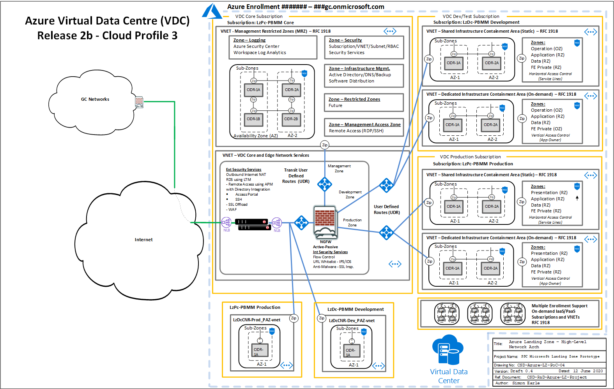
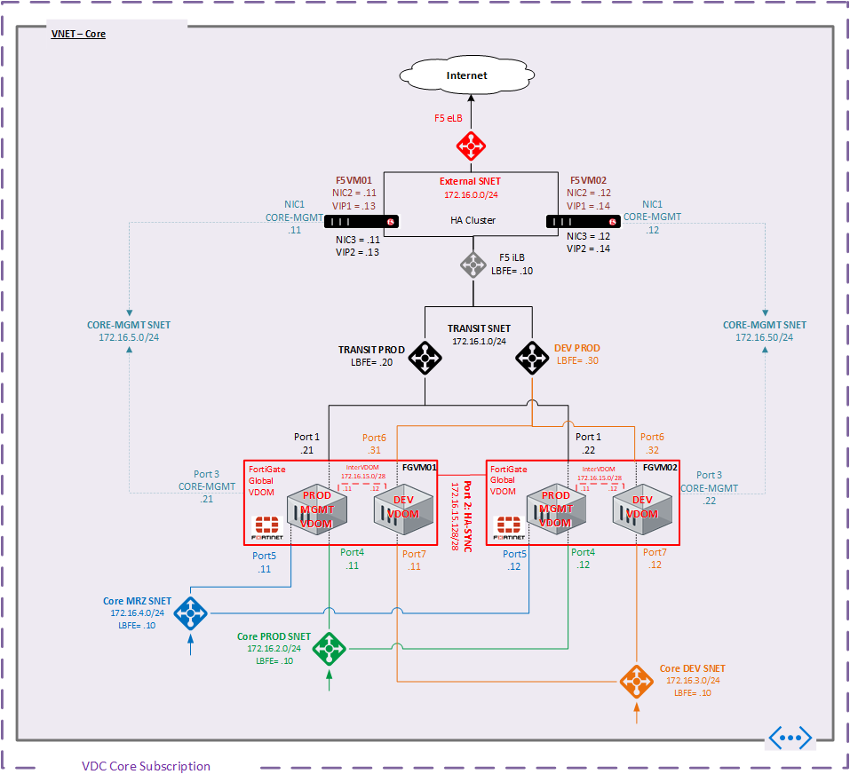

# High-Level Architecture

______________________

# Network Core r2b With Subscriptions

This diagram depicts the Landing Zone Base Cloud architecture implemented with this code package.  Guided by ITSG-22 principles, the hub and spoke design deploys a fully redundant set of security appliances to protect the resources within the environment.   The Core Subscription/vNet contains the security appliances that are static to the environment, including:

 - F5 cluster at the network edge to provide External Access Network (EAN) security controls, application delivery, and remote access.
 - Fortigate Cluster at the Internal Access Network (IAN) provides a second layer of UTM security to protect high value resources that typically reside in the various restricted zones (RZ).  

Spoke vNets provide server zones for various workloads including a DMZ zone (PAZ), Application Restricted Zones (RZ), and Data Restricted Zone (RZ).   The PROD Environment is mirrored in a DEV environment for testing and QA.  In this release, the Fortigates uses virtual Domains (VDOM) to manage PROD and DEV traffic flow.
______________________

# Network Core r2b

This diagram of the Core vNET provides a reference for all the subnets and IP allocations of all F5 and Fortigate appliances that is deployed by the code.  Also shown are the Azure Load Balancer constructs used to facilitate High Availability of the security appliances.

* For Routing details See [Routing and Flow Control Overview](Routing_Overview.md)
* For Application Dataflow details see [Application Dataflow - HA and AzLB](Application_Dataflow_-_HA_and_AzLB.md)
