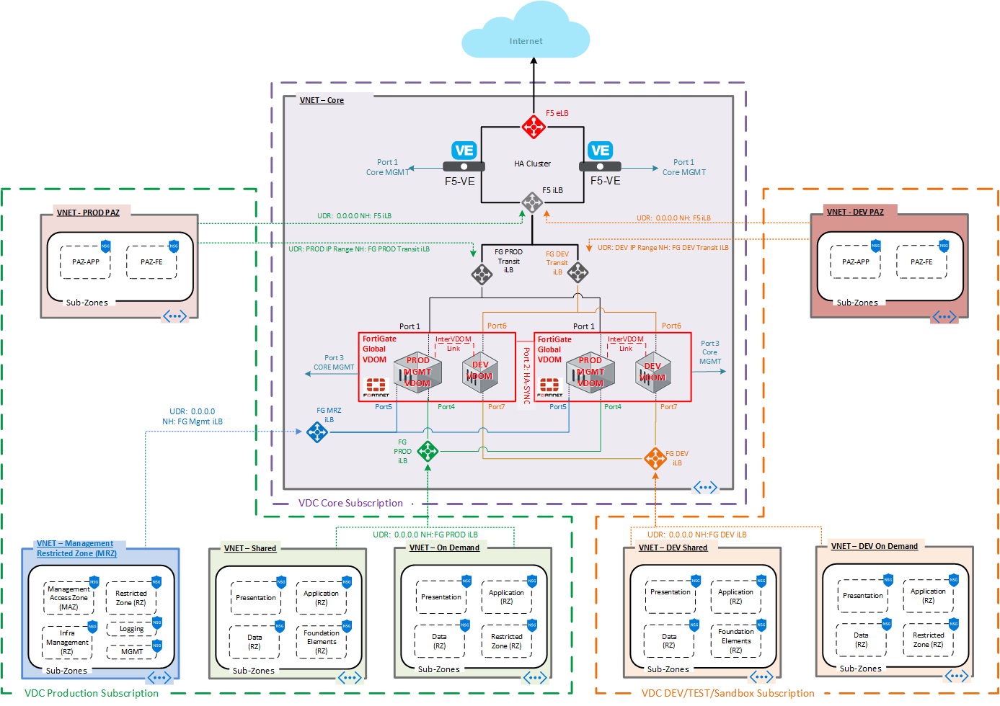
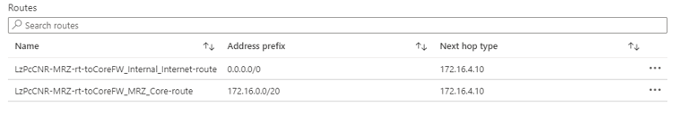
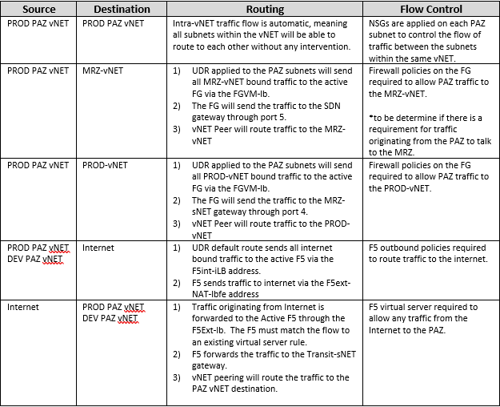
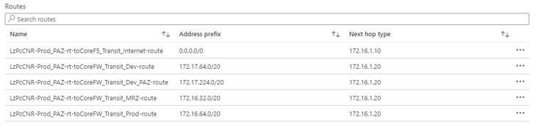
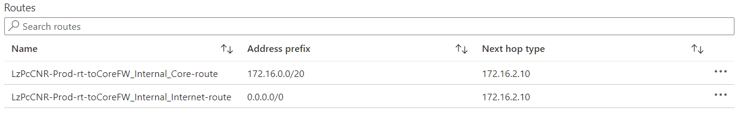

Routing and Flow Control Overview
=================================

This section describes how the routing and flow control mechanisms are configured for the environment. The Azure SDN routing basics can be found here
<https://docs.microsoft.com/en-us/azure/virtual-network/virtual-networks-udr-overview>.

Some general rules for routing are:

-   All traffic that is forwarded to an NVA (Network Virtual Appliance),
    either the F5 or the FG, must be directed at the Azure Load
    balancers to ensure the traffic gets directed to the Active node in
    the HA Cluster.

-   In general, all traffic between DEV and PROD are forwarded to the
    Fortigate through the routing tables. There are currently no
    requirements for these flows, but since routing is configured to
    support future needs. These PROD \<-\> DEV flows are supported
    through the inter-VDOM links configured in the FortiGate.

Some general rules for flow control are:

-   Intra-vNET flows are controlled using NSGs

-   Inter-vNET flows are managed by the FG and/or the F5.

-   Inbound traffic must always be permitted by the F5 through a virtual
    server configuration.

-   Inbound traffic from the internet should only be allowed to
    communicate with resources in the PAZ.

-   Outbound traffic to the internet must be explicitly permitted by the
    FG and/or the F5.

Network Diagram
---------------

The diagram below depicts the entire Landing Zone deployment.

Management Restricted Zone (MRZ) Traffic Flows
----------------------------------------------

The following table describes the traffic flow from the MRZ.

All outbound traffic is sent to the Fortigate.

Public Access Zone (PAZ) Traffic Flows
--------------------------------------

The table below describes the traffic flow from the PAZ vNETs.

-   DEV\_PAZ flows are identical to the PROD\_PAZ flows.

The LzPcCNR-PROD\_PAZ routing table with a basic set of routes is shown below.

Production Traffic Flows
------------------------

The following table describes the traffic flow from the PROD vNET.

-   DEV vNET traffic flows are identical.

The route table (LzPcCNR-Prod-rt) for all subnets in the PROD vNET is shown below. The User Defined Route (UDR) forwards traffic to the F5VM-LB, which in turn will send the traffic to the active LB for processing.

