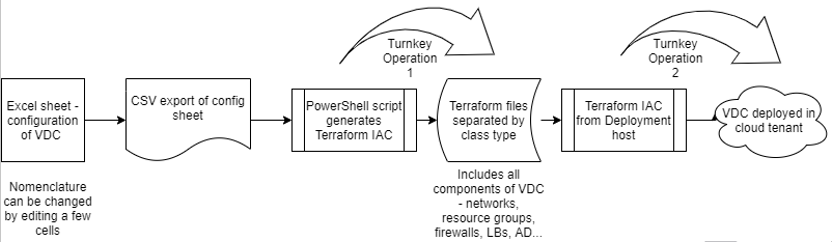
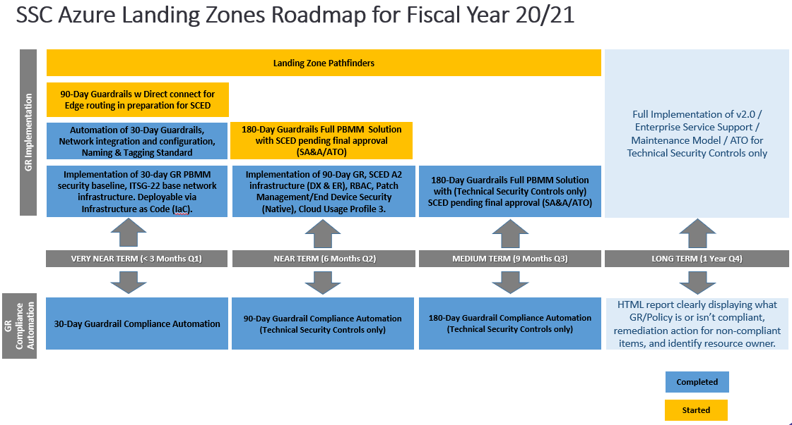

# Azure_LZBCA-AIZDB
Azure Landing Zone Base Cloud Architecture - Architecture infonuagique zone d'atterrissage de base

This initiative is a contribution to the GC Accelerators.

These tools and IaC (Infrastructure as Code) enable the Government of Canada's Cloud First direction and support for the GC Digital Standards.

The users of this initiative will be Government of Canada employees deploying cloud-based workloads.

# Background

The Azure Landing Zone Base Cloud Architecture **(LZBCA)** is an initiative that is led by Cloud Product Management & Services - Research & Development team. 
  
The Azure LZBCA is a fully functional Virtual Data Centre (VDC) with all the necessary components required to meet the Cloud PBMM Security profile. It aligns with Cloud Usage Profile 3 with a future design for Cloud Usage Profiles 5 & 6. 
* For Network details See [Network Architecture](Network/README.md)
* For Routing details See [Routing and Flow Control Overview](Network/Routing_Overview.md)
* For Application Dataflow details see [Application Dataflow - HA and AzLB](Network/Application_Dataflow_-_HA_and_AzLB.md)

It has been designed to enable departments to leverage and quickly deploy an Azure Landing Zone that aligns with a departments naming standards and IP blocks.

We will be starting our Security Assessment (SA) on the environment in June 2020. 

Development of the Azure LZBAC will continue to add functionality for components such as: SCED, AD, RBAC and etc., this development will move forward in parallel with the SA process. For a complete list of current and future development "Available Today" and "Future Releases" below.

______________________

## How to Contribute

See [CONTRIBUTING.md](CONTRIBUTING.md)

## License

Unless otherwise noted, the source code of this project is covered under Crown Copyright, Government of Canada, and is distributed under the [MIT License](LICENSE).

The Canada wordmark and related graphics associated with this distribution are protected under trademark law and copyright law. No permission is granted to use them outside the parameters of the Government of Canada's corporate identity program. For more information, see [Federal identity requirements](https://www.canada.ca/en/treasury-board-secretariat/topics/government-communications/federal-identity-requirements.html).

______________________

# Code Generation Pipeline

The code pipeline begin with an VDC input configuration spread sheet, this is used to build a control file that is ingested by a PowerShell script to create all the necessary Terraform “*.tf” files required to deploy a VDC.

## VDC Configuration Spreadsheet defines the following values
Resource groups, virtual and sub networks, peering and user defined routing, Virtual machines + availability sets, Windows domain controller, Fortinet HA firewall, F5/Azure HA load balancer, Azure SDN app, Log analytics Workspace, NICs + temporary public Ips [config & licensing], network security groups, Azure security center [+ subscription activation]

# Future Development Roadmap

# **Available Today**
1. Azure LZBCA r2b = fully functional VDC
   - Core Security Infrastructure
     - F5
       - HA pair (Active/Passive)
       - Outbound Internet NAT
       - Application Delivery (LTM)
         - SSL Offload
       - Remote Access (APM)
         - Access Portal
         - RDS Proxy 
     - FortiGate
       - VM-08 HA pair (Active/Passive)
       - Prod and Dev separation using vDOMs
       - Flow Control
       - URL Whitelist
       - IPS/IDS
       - Anti-Malware
       - SSL Inspection
   - ITSG-22 Zoning
     - Management Restricted Zone (MRZ)
     - Management Access Zone (MAZ)
     - Public Access Zone (PAZ) > Prod & Dev
     - Operation Zone (OZ) > Prod & Dev
     - Data Restricted Zone (RZ) > Prod & Dev
     - Application Restricted Zone (RZ) > Prod & Dev
     - FE Private Restricted Zone (RZ) > Prod & Dev
2. Managed Service available to help deploy an Azure Landing Zone with aligned naming standards and IP blocks.
3. Azure Naming and Tagging Standards
4. 30-Day Guardrail Implementation Guide
5. Reporting tool
6. Deploys a Local Active Directory (azure.local)

# **Future Releases**
1. 30 Day Guardrail Compliance Automation Tool (r2c)
2. Integrate F5 into pipeline (r2c)
3. Modularize Terraform Deployement
   - F5 (r2c)
   - FortiGate (r2c)
   - Core Infrastructure (r2c)
   - Bolt on Components
     - Subscription (r2d)
     - Resource Group (r2d)
     - vNets/sNets (r2d)
     - Key Vault (r2d)
4. IaaS/PaaS Guardrail Compliance Automation
   - 30-Day Guardrails (r2c)
   - 90-Day Guardrails (r2d)
   - 180-Day Guardrails (r2d)
5. Separate FortiGate HA pairs for Prod and Dev (r2c)
6. SCED Connectivity / Cloud Usage Profile 5 & 6 (r2d)
7. Active Directory Domain Services - Ground <-> Cloud (r2d)
8. ATO - Cloud PBMM Security Profile (Technical Controls Only)
9. F5 authentication to used local Active Directory
10. Hardening of all infrastructure
11. High-Level Governance Framework 

______________________

# Current Release Limitations

Azure LZBCA release 2b has a couple limitations when using the pipeline to generate new *.TF files to create a custom VDC, these limitations are:

1. The F5 code in this repository is fully functional, however it did not go through the pipeline and was manually configure via IaC. This will be rectified for our r2c release.  If you require to customize a deployment (integrate your naming standard and IP blocks) before our next release, we suggest to leverage our managed service to help with the process.

2. There are also a list of pre and post deployment steps that are required, these are available here See [LZ Deployment Steps](Terraform/README.md).  We plan to automate some of these steps in future

______________________

# Notes

Post deployment tasks:

**Must change all default passwords and userids for all accounts.**

______________________

**Translation will be offered on a future release**
______________________

