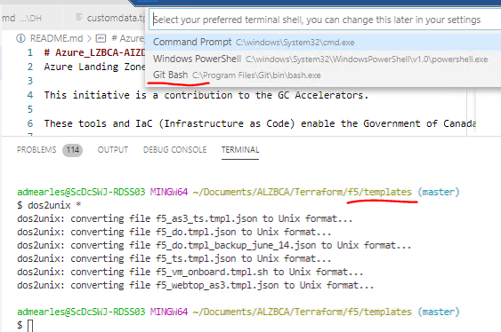
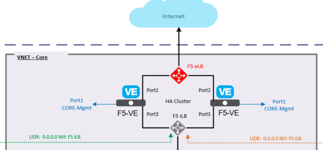

## Deployment Notes for the F5

Before executing the Terraform apply please check the following conditions

* The "LzPc-Security_Core_External-rg" resource group must be excluded from the "no public IP" policy
* The f5_api_data.tf must have valid license keys on line 5 and 41
* We have seen intermittent failures executing the rendered bootstrapping script /var/lib/waagent/CustomData. This is due to the way the "F5/templates/f5_vm_onboard.tmpl.sh" is generated. Depending on your editor, the end of line charater may be changed which causes the F5VM extension to fail during build (we have seen different issues from exit before execution to running in an endless loop). To fix this issue execute ["Dos2Unix ./*"] in a bash shell (Embedded end of line characters are not visible in most editors).
  
        EOL_MAC="Mac"               # File EOL Classic Apple Mac  (CR)
        EOL_UNIX="Unix"             # File EOL UNIX               (LF)
        EOL_WINDOWS="Windows"       # File EOL Windows            (CRLF)

* Easy to do in VSCode - open a bash shell and execute before running Terraform apply if weird stuff is happening during the build (seems random on which lines in the shell script get the wrong end of line character).
  

## Builds a Active-Passive F5 HA configuration with both External and Internal Azure load balancers:

* Detailed notes are provided in the supporting documentation

