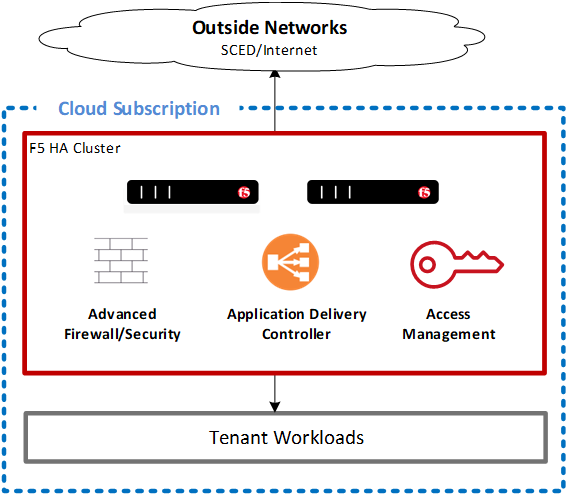
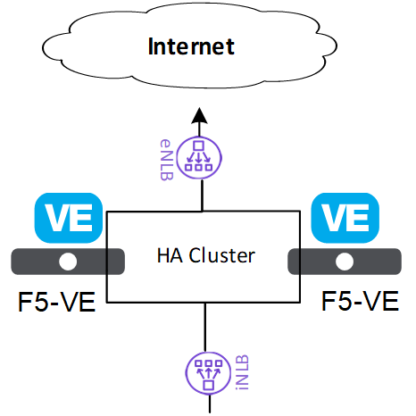

## Builds a Active-Passive F5 HA configuration with both External and Internal Azure load balancers:

The Edge Network consists of a pair of Big-IP Virtual Edition active-passive F5 appliances that will provide the following services:

* Application delivery controller using the Local Traffic Manager module (LTM)
* Security services using the Advanced Firewall Module (AFM)
* Web Application Firewall (WAF)
* Access control using the Access Policy Manager (APM) 

When connected to the internet - F5 takes the role of the External Access Network (EAN) boundary system (perimeter device) between the Public Zone (PZ) and the Public Access Zone (PAZ) as outlined by ITSG-22.

When connected to SCED – depending on what security services SCED offers, F5 will continue to offer Application delivery services, and can also act as a Zone Interface Point (ZIP) as required.

Using the Azure native loadbalancers provides a couple enhancements to the F5 functionality including:

* Faster failover times between the Active and Passive nodes. Vendor recommendation that the Azure NLB be used instead of the Cloud Failover Extension (CFE) - the CFE call to the AZURE APIs has significantly varying response times – 30secs to many minutes in order to failover.  Requires both internal and external NLB to be implemented.  Note that using the cloud native LB may not be required in AWS since the cloud failover mechanisms are much faster.

* Port Mapping to alleviate the maximum IP address limitations on the F5 external interfaces (maximum of 256).  This is configured on the external NLB where many public IPs on the eNLB can be mapped to the same Virtual address on the F5 but using different TCP ports.  

## Deployment Notes for the F5

Before executing the Terraform apply please check the following conditions

* The "LzPc-Security_Core_External-rg" resource group must be excluded from the "no public IP" policy
* The f5_api_data.tf must have valid license keys on line 5 and 41
* We have seen intermittent failures executing the rendered bootstrapping script /var/lib/waagent/CustomData. This is due to the way the "F5/templates/f5_vm_onboard.tmpl.sh" is generated. Depending on your editor, the end of line charater may be changed which causes the F5VM extension to fail during build (we have seen different issues from exit before execution to running in an endless loop). To fix this issue execute ["Dos2Unix ./*"] in a bash shell (Embedded end of line characters are not visible in most editors).
  
        EOL_MAC="Mac"               # File EOL Classic Apple Mac  (CR)
        EOL_UNIX="Unix"             # File EOL UNIX               (LF)
        EOL_WINDOWS="Windows"       # File EOL Windows            (CRLF)

* Easy to do in VSCode - open a bash shell and execute before running Terraform apply if weird stuff is happening during the build (seems random on which lines in the shell script get the wrong end of line character).
  

* Detailed notes are provided in the supporting documentation

