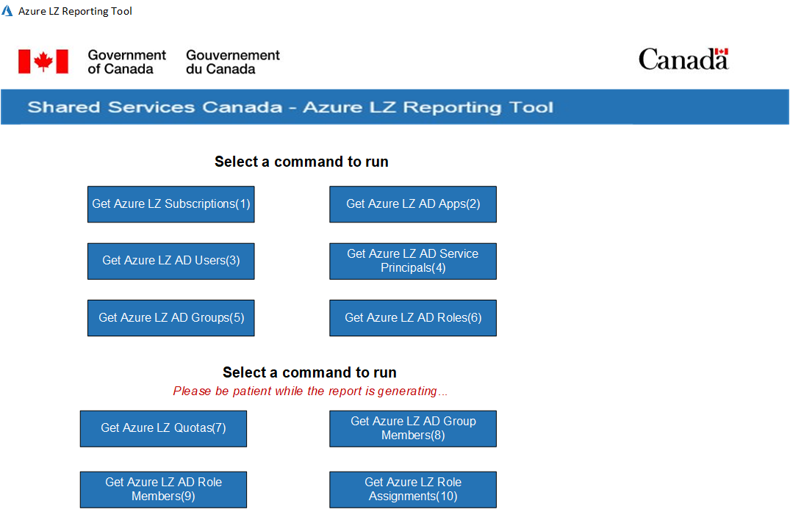

# Azure Report Generator Tool

______________________

# Instructions 

Please review the SOP-Azure LZ Reporting Tool.docx document for instructions on how to edit and use this tool.

[SOP AzureLZ Reporting Tool](SOP/SOP-AzureLZ-Reporting-Tool-v1.1.pdf)

# Notable Files

* `Azure_LZ-Reporting_Tool.exe` The tool itself.  

* `Azure_LZ-Reporting_Tool.ps1` The PowerShell code.  

* `\SOP\SOP-Azure LZ Reporting Tool.docx` Standard Operation Procedure documenting how to edit and use the tool.  

* `\base64_encode\ConvertToBase64String.ps1` Tool used to encode images into your code.  

* `\base64_encode\baseImage64_Encode_Example.ps1` Example of image to code.  

* `\templates\General_Template.ps1` Example template of tool. 
